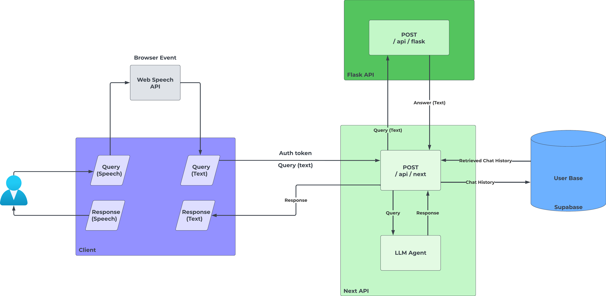
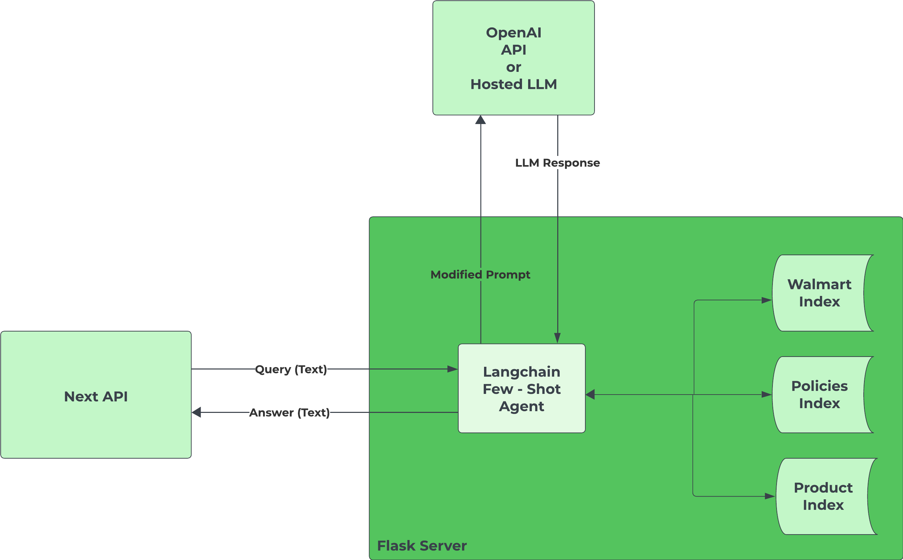

# ConvAI - AI for Customer Service

In today's digital landscape, we've all experienced the frustration of enduring lengthy and monotonous customer support calls. Often, the majority of our time is spent on hold, being transferred from one agent to another, subjected to frustrating waiting periods.

Addressing this challenge, This is a Conversational AI solution Powered by Generative AI, our solution delivers human-like interactions, fostering natural and meaningful exchanges. This AI has been extensively trained to engage in dialogues, promptly addressing inquiries by drawing from the operational expertise of the respective company.

For this specific illustration, we scraped operational data from publicly available sources of Walmart. I used Few-shot learning method to train our LLM model using this data, ensuring an accurate and contextually relevant AI-driven conversation.


## Index

- [Tech Stack](#tech-stack)
- [Data Indexes](#data-indexes)
- [Internal Working](#internal-working)
- [References](#references)

## Tech Stack

| Name       | Description                                                                                  |
|------------|----------------------------------------------------------------------------------------------|
| OpenAI API | Used for accessing a hosted LLM like text-davinci-003, GPT 3.5, GPT 3.5 Turbo etc.           |
| Langchain  | Used for creating a LLM Agent and training this agent using the Few-Shot Prompting Template. |
| Flask      | Used for serving the LLM Agent to the NextJS API.                                            |
| FAISS      | Used for making vector store indexes using GPT4All Word Embeddings of additional context for the Agent. |
| NextJS     | Used for serving the frontend of the application.                                            |
| Supabase   | Will be used for storing user chat history and Auth details. (Integration is in-progress) |
| Web Speech API | Used for Speech to Text and Text to Speech conversion. | 


## Data Indexes

- An LLM agent can use various tools to form an accurate response to a user query. These tools can be as follows: 
	- Retrieving text data by scraping a webpage on the internet.
	- Searching relevant data available on a SQL database.
	-  Retrieving chunks of text data from a vector store index.
- We are also using data retrieval tools to get information related to the user query from vector indexes which are currently based on an E-commerce giant, Walmart. 
- Total 3 indexes are currently being used namely:
	- **Walmart Index**: Contains general publicly available information related to Walmart.
	- **Policies Index**: Contains all the policies pertaining to Walmart. Eg: Return Policy, Price-match Policy etc.
	- **Product Index**: Contains information related to the product catalogue of Walmart.
- One can find these indexes in the data folder at this location ```flask/services/data```


## Internal Working


 

- **Note**: In the above diagram Supabase is also mentioned there but currently the Supabase integration is in-progress.




## References
- [Langchain Docs](https://docs.langchain.com/docs/)
- [Web Speech API](https://developer.mozilla.org/en-US/docs/Web/API/Web_Speech_API)
